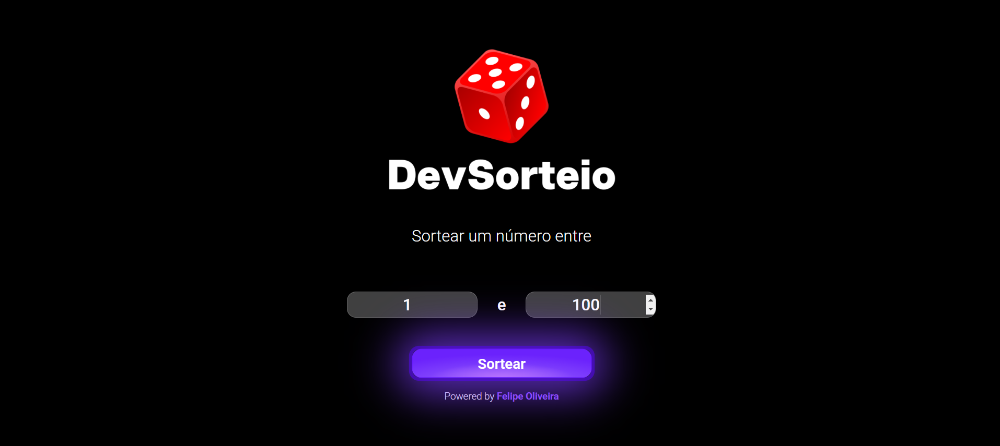

# 🎲 Dev Sorteio

Um projeto simples e interativo que permite ao usuário sortear um número aleatório com base nos valores mínimo e máximo escolhidos. Conta com um spinner de carregamento para uma experiência mais dinâmica.

## 🔗 Acesse o projeto

Confira o site ao vivo: [Dev Sorteio](https://felipeoliveiracode.github.io/dev-sorteio/)

---

## 🛠️ Tecnologias Utilizadas

- **HTML**: Estruturação da página.
- **CSS**: Estilização completa, incluindo o spinner de carregamento e responsividade.
- **JavaScript**: Lógica do sorteio, manipulação do DOM e interatividade.

---

## ✨ Funcionalidades

- **Intervalo de sorteio:** O usuário pode definir um valor mínimo e máximo para o sorteio.
- **Geração aleatória:** Retorna um número aleatório dentro do intervalo fornecido.
- **Spinner de carregamento:** Exibe uma animação de carregamento enquanto o sorteio é realizado.
- **Feedback interativo:** Mensagens claras e elementos visuais que melhoram a experiência do usuário.

---

## 📸 Demonstração Visual

### Tela inicial

### Sorteio em andamento

### Resultado

---
